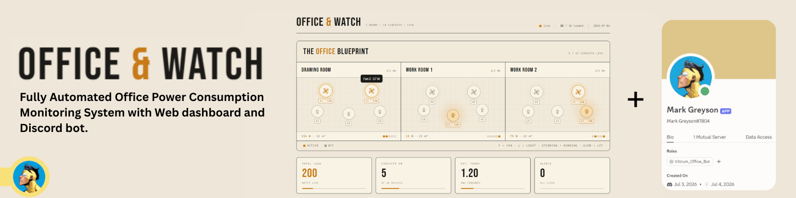
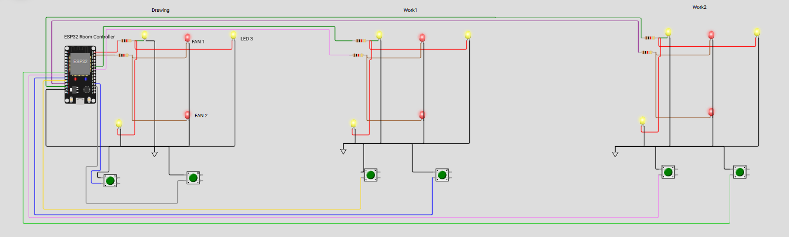

<div align="center">
  <p>
    
  </p>

  
  
  
  
  
  
  
  
  <br><br>

  <em>Real-time electrical monitoring for 15 simulated devices across 3 office rooms,<br>
  with a live web dashboard and a Discord bot — both reading from one shared FastAPI backend.</em>
</div>

<br>

<div align="center">

**[📖 Documentation](#-architecture)** · **[🚀 Quick Start](#-quick-start)** · **[🤖 Bot Commands](#-discord-bot-commands)** · **[📊 System Diagram](#-system-diagram)** · **[⚡ Alert Rules](#-alert-rules)**

</div>

---

## Project Structure

```
office-watch/
├── backend/                  # FastAPI backend (single source of truth)
│   ├── alerts.py             # Alert engine — after-hours + stuck-on rules
│   ├── main.py               # App entrypoint, REST + SSE endpoints, lifespan
│   ├── models.py             # Pydantic schemas (Device, Alert)
│   ├── requirements.txt      # fastapi, uvicorn, pydantic
│   ├── simulator.py          # asyncio task — flips devices every 3–15s
│   ├── sse_manager.py        # SSE broadcast hub (asyncio.Queue per client)
│   └── store.py              # In-memory DeviceStore (dict of 15 devices)
│
├── frontend/                 # React + Vite + TypeScript dashboard
│   ├── src/
│   │   ├── App.tsx           # Root layout + stat tiles
│   │   ├── components/
│   │   │   ├── OfficeLayout.tsx      # Blueprint with animated device nodes
│   │   │   ├── PowerMeter.tsx        # Per-room wattage bars + kWh
│   │   │   ├── AlertsPanel.tsx       # Active alert cards
│   │   │   └── DeviceStatusPanel.tsx # All 15 circuits table
│   │   ├── hooks/
│   │   │   └── useDeviceStream.ts    # REST fetch + EventSource hook
│   │   └── types/
│   │       └── index.ts              # Device, Alert, SSEPayload types
│   └── vite.config.ts        # Dev proxy → backend :8000
│
├── bot/                      # Discord bot with LLM humanization
│   ├── bot.py                # 4 commands + proactive alert polling
│   ├── .env.example          # Token / API key template
│   └── requirements.txt      # discord.py, httpx, groq, dotenv
│
├── Schematics/               # Wokwi simulation files
│   ├── ESP32 NTP Example.ino # ESP32 simulation firmware code
│   ├── diagram.json          # Wokwi component layout connection definitions
│   ├── image.png             # Screenshot of Wokwi wiring and schematic
│   ├── libraries.txt         # Wokwi simulation library dependencies
│   └── wokwi-project.txt     # Wokwi project configuration details
│
├── diagrams/                 # Diagrams & visual assets
│   ├── discord-bot-profile.jpg               # Discord bot profile image
│   ├── image.png                             # Representative schematic image
│   ├── office_watch_infographic (3) (1).png  # Main infographic with gradient background
│   ├── project-banner.png                    # Header banner image
│   ├── site-image1.png                       # System diagram / site overview
│   └── system_diagram.md                     # System architecture documentation
│
├── BUILD.md                  # Project build guide
├── DESIGN.md                 # Design system specification
├── PRODUCT.md                # Product description and principles
├── README_SHOWCASE.md        # Showcase README (this file)
├── readme.md                 # Quick-start README
└── .gitignore                # Global git ignores
```

---

## Quick Start

Get Office Watch running locally in under 2 minutes. Each component starts independently.

<details open>
<summary><b>1. Backend</b></summary>

```bash
cd backend
pip install -r requirements.txt
uvicorn main:app --reload --port 8000
```

| Endpoint | URL |
|----------|-----|
| API Root | `http://localhost:8000` |
| All Devices | `http://localhost:8000/api/devices` |
| SSE Stream | `curl -N http://localhost:8000/stream` |

</details>

<details open>
<summary><b>2. Frontend</b></summary>

```bash
cd frontend
npm install
npm run dev
```

Dashboard live at **`http://localhost:5173`** — auto-proxies `/api` and `/stream` to the backend.

</details>

<details open>
<summary><b>3. Discord Bot Setup</b></summary>

1. **Invite the Bot**: Click the link below to invite the bot to your Discord server:
   👉 [**Invite Link**](https://discord.com/oauth2/authorize?client_id=1522659680399392888&permissions=2147600384&integration_type=0&scope=bot+applications.commands)

2. **Install Dependencies & Start**:
   ```bash
   cd bot
   pip install -r requirements.txt
   cp .env.example .env
   ```

4. **Set Up Env Variables** (`bot/.env`):
   - Add your bot token: `DISCORD_TOKEN=your_token_here`
   - (Optional) Enable Llama-3 natural language responses: `GROQ_API_KEY=your_key_here`
   - (Optional) Set up proactive alert warnings: `ALERT_CHANNEL_ID=your_channel_id_here`

5. **Run the Bot**:
   ```bash
   python bot.py
   ```

</details>

---

## Architecture

The system follows a **single-backend, two-client** architecture. Both the React dashboard and the Discord bot are read-only consumers of the same FastAPI process — they never disagree with each other.
<p>
    
  </p>


### Data Flow — Step by Step

| Step | What Happens |
|------|-------------|
| **1** | **Simulator** flips a random device's `status` every 3–15 s and updates `last_changed`. It is the *only writer* of state. |
| **2** | **DeviceStore** is one in-memory dict of 15 devices — nothing else holds a copy. |
| **3** | **Alert Engine** reads DeviceStore every 30 s, checks two rules, and on a new trigger: logs it, pushes it over SSE, and optionally POSTs to a Discord webhook. |
| **4** | **Dashboard** does one REST `GET` on load for initial state, then opens one `EventSource` connection and applies push updates — no polling, no manual refresh. |
| **5** | **Discord Bot** is a separate process. Every command triggers a REST call to the backend, gets JSON back, and (optionally) passes it through Groq to produce a friendly sentence. |

---


---

## Discord Bot Mark Greyson Commands

<div align="center">
  
</div>

<br>

| Command | Description | Example |
|---------|-------------|---------|
| `!ping` | 🟢 Health check | — |
| `!status` | Full office summary (all 3 rooms) | `!status` |
| `!room <name>` | Status of one room | `!room drawing`, `!room work1`, `!room work2` |
| `!usage` | Total wattage + per-room breakdown + kWh estimate | `!usage` |

**Room aliases:** `draw` → Drawing Room · `wr1` → Work Room 1 · `wr2` → Work Room 2

### Bot Responses

Responses come from **real backend data** — never hardcoded. When a Groq API key is configured, the bot passes raw JSON through **Groq LLM** (`openai/gpt-oss-20b`) to produce humanized, friendly sentences. If the LLM fails or rate-limits, the bot falls back to **plain-text** — never to nothing.

**Bonus:** The bot proactively posts alerts to a designated channel when devices are left on after hours.

---

## 🔧 Environment Variables

<details open>
<summary><b>Bot <code>.env</code> Configuration</b></summary>

| Variable | Required | Default | Description |
|----------|----------|---------|-------------|
| `DISCORD_TOKEN` | ✅ | — | Bot token from Discord Developer Portal |
| `BACKEND_URL` | ✅ | `http://localhost:8000` | Backend API URL |
| `GROQ_API_KEY` | Optional | — | For humanized responses via Groq LLM |
| `ALERT_CHANNEL_ID` | Optional | `0` | Channel ID for proactive alert messages |
| `ALERT_POLL_SECONDS` | Optional | `30` | How often to poll alerts (seconds) |

</details>

---

## ⚡ Alert Rules

The alert engine runs as an async background task, checking two rules every 30 seconds:

<details open>
<summary><b>After-Hours Rule</b></summary>

- **Office hours:** 9:00 AM – 5:00 PM
- **Trigger:** Any device with `status == "on"` outside that window
- **Dedup:** One alert per device per continuous on-period — no spamming every tick
- **Reset:** Flag clears when the device turns off or office hours resume

</details>

<details open>
<summary><b>Room Stuck-On Rule</b></summary>

- **Trigger:** All 5 devices in a room have had `status == "on"` continuously for 2+ hours
- **Tracking:** `room_all_on_since` timestamp per room, reset when any device turns off
- **Dedup:** Fires once when the 2-hour threshold is crossed, not repeatedly

</details>

---

## API Contract

All endpoints return JSON. The SSE stream and REST API share **identical schemas** — both clients parse the same shape.

---

### 📂 REST Endpoints

<details>
<summary>🟢 <b>GET</b> <code>/api/devices</code> — Retrieve status of all 15 simulated office devices</summary>
<br>

> **Description:** Returns the current state, status, name, and power consumption for all 15 simulated office devices.

#### Parameters
*None*

#### Responses
| Code | Description | Schema |
| :--- | :--- | :--- |
| **200** | Success | `Device[]` (Array of devices) |

##### Example Response (200 OK)
```json
[
  {
    "id": "wr1-fan1",
    "name": "Fan 1",
    "type": "fan",
    "room": "work1",
    "status": "on",
    "power_w": 58.3,
    "last_changed": "2026-07-03T14:22:10Z"
  }
]
```
</details>

<details>
<summary>🟢 <b>GET</b> <code>/api/rooms/{room}</code> — Get devices in a specific room</summary>
<br>

> **Description:** Returns the 5 devices belonging to the specified office room.

#### Parameters
| Name | Located In | Type | Required | Description |
| :--- | :--- | :--- | :--- | :--- |
| `room` | path | `string` | Yes | Room name: `drawing`, `work1`, or `work2` |

#### Responses
| Code | Description | Schema |
| :--- | :--- | :--- |
| **200** | Success | `Device[]` (Array of 5 devices) |
| **404** | Not Found | `{ "detail": "Unknown room: {room}" }` |

##### Example Response (200 OK)
```json
[
  {
    "id": "dr-light1",
    "name": "Light 1",
    "type": "light",
    "room": "drawing",
    "status": "off",
    "power_w": 0.0,
    "last_changed": "2026-07-04T09:40:00Z"
  }
]
```
</details>

<details>
<summary>🟢 <b>GET</b> <code>/api/usage</code> — Get current power consumption breakdown</summary>
<br>

> **Description:** Returns a breakdown of total live wattage, per-room live wattage, and estimated daily energy consumption (kWh).

#### Parameters
*None*

#### Responses
| Code | Description | Schema |
| :--- | :--- | :--- |
| **200** | Success | `UsageData` |

##### Example Response (200 OK)
```json
{
  "total_w": 182.5,
  "per_room": {
    "drawing": 62.1,
    "work1": 15.3,
    "work2": 105.1
  },
  "kwh_today": 1.095
}
```
</details>

<details>
<summary>🟢 <b>GET</b> <code>/api/alerts</code> — Get active alerts</summary>
<br>

> **Description:** Returns a list of all currently unresolved, active system alerts (after-hours usage or room stuck-on).

#### Parameters
*None*

#### Responses
| Code | Description | Schema |
| :--- | :--- | :--- |
| **200** | Success | `Alert[]` (Array of active alerts) |

##### Example Response (200 OK)
```json
[
  {
    "id": "alert-0007",
    "type": "after_hours",
    "room": "work1",
    "message": "Work Room 1: Fan 1 is ON at 10:04 PM (after hours)",
    "triggered_at": "2026-07-03T22:04:00Z",
    "active": true
  }
]
```
</details>

---

### 📡 Real-time SSE Stream

<details>
<summary>🔵 <b>GET</b> <code>/stream</code> — Server-Sent Events stream connection</summary>
<br>

> **Description:** Opens a persistent one-way connection that streams real-time state changes and alerts immediately as they occur.

#### Parameters
*None*

#### Responses
| Code | Description | Schema |
| :--- | :--- | :--- |
| **200** | Persistent Stream | `text/event-stream` returning events shaped as `{type, data}` |

##### Stream Payload Example
```jsonc
// Device Update event:
data: {"type": "device_update", "data": {"id": "wr1-fan1", "status": "on", ...}}

// Alert event:
data: {"type": "alert", "data": {"id": "alert-0007", "type": "after_hours", ...}}
```
</details>

---

<details>
<summary><b>📦 Data Models</b></summary>
<br>

```jsonc
// Device Model
{
  "id": "wr1-fan1",              // room_prefix-type+index
  "name": "Fan 1",
  "type": "fan",                 // "fan" | "light"
  "room": "work1",               // "drawing" | "work1" | "work2"
  "status": "on",                // "on" | "off"
  "power_w": 58.3,               // fans ~60W, lights ~15W, ±5W randomization
  "last_changed": "2026-07-03T14:22:10Z"
}
```

```jsonc
// Alert Model
{
  "id": "alert-0007",
  "type": "after_hours",         // "after_hours" | "room_stuck_on"
  "room": "work1",               // or null if office-wide
  "message": "Work Room 1: Fan 1 is ON at 10:04 PM (after hours)",
  "triggered_at": "2026-07-03T22:04:00Z",
  "active": true
}
```

```jsonc
// SSE Event Envelope
{
  "type": "device_update",       // "device_update" | "alert"
  "data": { /* Device or Alert object */ }
}
```
</details>


---

## Office Layout

**3 rooms · 15 devices · 2 fans + 3 lights per room**

| Room | Devices | Max Power |
|------|---------|-----------|
| Drawing Room | `dr-fan1`, `dr-fan2`, `dr-light1`, `dr-light2`, `dr-light3` | ~165W |
| Work Room 1 | `wr1-fan1`, `wr1-fan2`, `wr1-light1`, `wr1-light2`, `wr1-light3` | ~165W |
| Work Room 2 | `wr2-fan1`, `wr2-fan2`, `wr2-light1`, `wr2-light2`, `wr2-light3` | ~165W |

> **Power budget:** Fans draw ~60W ±5W, Lights draw ~15W ±5W. Max theoretical load = **1,170W**

---

## Tech Stack

| Layer | Technology | Purpose |
|-------|-----------|---------|
| **Backend** | Python · FastAPI · Uvicorn · Pydantic v2 | REST API + SSE server + async tasks |
| **State** | In-memory dict (single process) | Single source of truth for 15 devices |
| **Real-time** | Server-Sent Events (SSE) | One-way server → client push |
| **Simulator** | `asyncio` background task | Flips device states every 3–15s |
| **Frontend** | React 18 · Vite · TypeScript | Live dashboard with animated device nodes |
| **Streaming** | Native `EventSource` API | Browser receives SSE updates |
| **Discord Bot** | discord.py · httpx | Command handling + REST calls to backend |
| **LLM** | Groq API (`openai/gpt-oss-20b`) | Optional humanization of bot responses |

---

## Evaluation Criteria Coverage

| Criterion | Weight | Satisfied By |
|-----------|--------|-------------|
| Working web dashboard, real-time | 20% | SSE push via `useDeviceStream` hook → React re-render |
| Working Discord bot, real data | 10% | 4 commands, REST calls to backend, rich embeds |
| Dashboard visuals / UX | 10% | Animated fans, glowing lights, power bars, office blueprint |
| System diagram | 15% | `diagrams/system_diagram.md` + `diagrams/office_watch_infographic.png` |
| Circuit schematic | 15% | `diagrams/` assets |
| Dummy data quality | 15% | Realistic wattages, dynamic changes, alert engine with 2 rules |
| Codebase / commits / docs | 15% | This README + incremental commit history |

---

## Schematics

<p>
    
</p>


<div align="center">
  <br>
  <b>Office Watch</b> · IUT Hackathon 2026 · Simulated data · No live hardware
  <br><br>
  <sub>Built with ❤️ using FastAPI, React, and Discord.py</sub>
</div>
